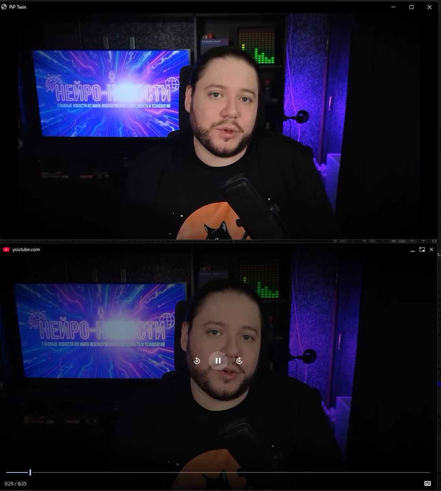

# PiP Twin

**A second window with the same playing video for Chrome — keep your Picture-in-Picture on the monitor, send the twin fullscreen to the TV.**

**[English](README.md)** · **[Русский](README_RU.md)**

PiP Twin is a Chrome extension that opens a second window with the same video playing in the tab. Chrome allows only one Picture-in-Picture window per browser, so the twin is a plain extension window with no address bar. It receives the already-decoded frames of the page `<video>` through `captureStream()`: same stream, same time, full resolution, no re-encoding. Built for watching on the work monitor while mirroring the picture onto a TV behind you.

## Features

- **One video on two screens** — drag the small PiP around the monitor as usual, blow the twin up fullscreen on the second display.
- **Same stream** — `captureStream()` delivers decoded frames, so the picture stays in sync, at full resolution, with no second download.
- **Window without an address bar** — the service worker re-creates the popup as an extension window, which Chrome renders without the omnibox.
- **Remembers its place** — position, size and fullscreen state are saved and restored the next time you open it.
- **Keyboard control** — pause, seek, mute and fullscreen straight from the twin window.
- **Runs locally** — no accounts, nothing sent out, all code lives in the extension folder.

## Install

1. Open `chrome://extensions`, enable **Developer mode** in the top right.
2. **Load unpacked** → pick this repository folder.

The extension is not published anywhere; it runs from the folder. Update with `git pull` and the **Update** button on its card.

## Usage

On a page with a playing video, click the toolbar icon or press **`Alt+Shift+P`**. Click again to close the twin.

| Key | Action |
| --- | --- |
| `F`, double-click | toggle fullscreen |
| `Esc` | leave fullscreen |
| `Space`, `K` | play / pause the original |
| `←` / `→` | seek 5 s |
| `J` / `L` | seek 10 s |
| `M` | mute / unmute the original |
| `Q` | close the twin |

## How it works

- Clicking the icon injects `twin.js` into every frame of the tab. The script finds the largest playing `<video>`, captures it with `captureStream()` and opens a window.
- The window is opened by the page, but the background service worker immediately re-parents it into an extension-owned popup window (`chrome.windows.create`, `type: popup`) — Chrome draws no address bar on those.
- Position and fullscreen state are kept in `chrome.storage.local` and restored on the next open.

**Limits.** DRM streams (Widevine) refuse `captureStream()` — regular YouTube works, paid movies do not. If a site blocks pop-ups, the icon shows `!`: allow pop-ups for that site and click again.

## Other Projects by [@timoncool](https://github.com/timoncool)

| Project | Description |
|---------|-------------|
| [ScreenSavy.com](https://github.com/timoncool/ScreenSavy.com) | Ambient screen generator for any display |
| [VideoSOS](https://github.com/timoncool/videosos) | AI video production in the browser |
| [GitLife](https://github.com/timoncool/gitlife) | Your life in weeks — interactive calendar |
| [Bulka](https://github.com/timoncool/Bulka) | Live-coding music platform |
| [telegram-api-mcp](https://github.com/timoncool/telegram-api-mcp) | Full Telegram Bot API as an MCP server |
| [ACE-Step Studio](https://github.com/timoncool/ACE-Step-Studio) | AI music studio — songs, vocals, covers, videos |

## Authors

- **Nerual Dreming** — [Telegram](https://t.me/nerual_dreming) | [neuro-cartel.com](https://neuro-cartel.com) | [ArtGeneration.me](https://artgeneration.me)

## Support the Author

I build open-source software and do AI research. Most of what I create is free and available to everyone. Your donations help me keep creating without worrying about where the next meal comes from =)

**[All donation methods](https://github.com/timoncool/ACE-Step-Studio/blob/master/DONATE.md)** | **[dalink.to/nerual_dreming](https://dalink.to/nerual_dreming)** | **[boosty.to/neuro_art](https://boosty.to/neuro_art)**

- **BTC:** `1E7dHL22RpyhJGVpcvKdbyZgksSYkYeEBC`
- **ETH (ERC20):** `0xb5db65adf478983186d4897ba92fe2c25c594a0c`
- **USDT (TRC20):** `TQST9Lp2TjK6FiVkn4fwfGUee7NmkxEE7C`

## Star History

<a href="https://github.com/timoncool/pip-twin/stargazers">
 <picture>
   <source media="(prefers-color-scheme: dark)" srcset="docs/stars-dark.svg" />
   <source media="(prefers-color-scheme: light)" srcset="docs/stars-light.svg" />
   
 </picture>
</a>

## License

MIT. `findLargestPlayingVideo()` is derived from [GoogleChromeLabs/picture-in-picture-chrome-extension](https://github.com/GoogleChromeLabs/picture-in-picture-chrome-extension) (Apache-2.0).
