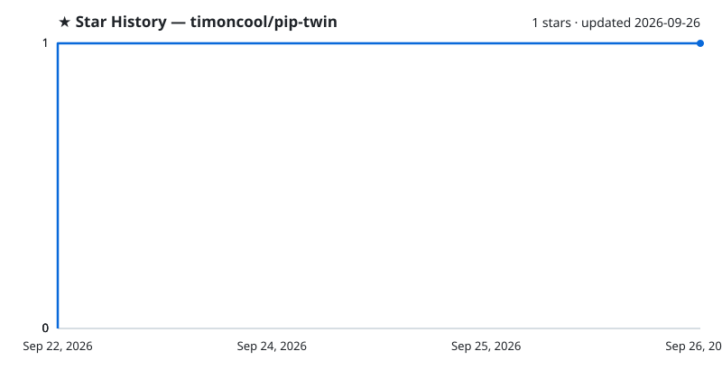

# PiP Twin

**Второе окно с тем же играющим видео для Chrome — свой «картинка в картинке» держишь на мониторе, близнеца выводишь во весь экран на телевизор.**

**[English](README.md)** · **[Русский](README_RU.md)**

PiP Twin — расширение Chrome, которое открывает второе окно с тем же видео, что играет во вкладке. Chrome разрешает ровно одно окно «картинка в картинке» на весь браузер, поэтому близнец — обычное окно расширения без адресной строки. Оно получает уже декодированные кадры страничного `<video>` через `captureStream()`: тот же поток, то же время, полное разрешение, без перекодирования. Для тех, кто смотрит на рабочем мониторе и хочет продублировать картинку на телевизор за спиной.

## Возможности

- **Одно видео на два экрана** — мелкий PiP на мониторе двигаешь как обычно, близнеца разворачиваешь во весь экран на втором.
- **Тот же поток** — `captureStream()` отдаёт декодированные кадры, поэтому картинка идёт синхронно, в полном разрешении, без второй загрузки.
- **Окно без адресной строки** — service worker пересоздаёт всплывающее окно как окно расширения, у которого Chrome не рисует омнибокс.
- **Запоминает место** — позиция, размер и полный экран сохраняются и восстанавливаются при следующем открытии.
- **Управление с клавиатуры** — пауза, перемотка, звук и полный экран прямо из окна близнеца.
- **Работает локально** — ни аккаунтов, ни загрузок наружу, весь код в папке расширения.

## Установка

1. Открой `chrome://extensions`, включи **Режим разработчика** справа сверху.
2. **Загрузить распакованное расширение** → выбери папку этого репозитория.

Расширение нигде не публикуется, работает из папки. Обновление — `git pull` и кнопка «Обновить» на карточке.

## Использование

На странице с играющим видео нажми иконку расширения или **`Alt+Shift+P`**. Ещё раз — близнец закрывается.

| Клавиша | Действие |
| --- | --- |
| `F`, двойной клик | полный экран |
| `Esc` | выйти из полного экрана |
| `Space`, `K` | пауза/плей оригинала |
| `←` / `→` | перемотка на 5 с |
| `J` / `L` | перемотка на 10 с |
| `M` | звук оригинала вкл/выкл |
| `Q` | закрыть близнеца |

## Как это работает

- Клик по иконке инжектит `twin.js` во все фреймы вкладки. Скрипт находит самый большой играющий `<video>`, снимает с него `captureStream()` и открывает окно.
- Окно создаёт страница, но фоновый service worker сразу пересоздаёт его как окно расширения (`chrome.windows.create`, `type: popup`) — у таких окон Chrome не рисует адресную строку.
- Позиция и полный экран хранятся в `chrome.storage.local` и восстанавливаются при следующем открытии.

**Ограничения.** DRM-потоки (Widevine) запрещают `captureStream()` — обычный YouTube работает, платные фильмы нет. Если сайт блокирует всплывающие окна, на иконке появится `!`: разреши всплывающие окна для сайта и нажми ещё раз.

## Другие проекты [@timoncool](https://github.com/timoncool)

| Проект | Описание |
|--------|----------|
| [ScreenSavy.com](https://github.com/timoncool/ScreenSavy.com) | Генератор эмбиент-экранов для любого дисплея |
| [VideoSOS](https://github.com/timoncool/videosos) | AI-видеопродакшн в браузере |
| [GitLife](https://github.com/timoncool/gitlife) | Жизнь в неделях — интерактивный календарь |
| [Bulka](https://github.com/timoncool/Bulka) | Платформа лайв-кодинга музыки |
| [telegram-api-mcp](https://github.com/timoncool/telegram-api-mcp) | Telegram Bot API как MCP-сервер |
| [ACE-Step Studio](https://github.com/timoncool/ACE-Step-Studio) | AI-студия музыки — песни, вокал, каверы, клипы |

## Авторы

- **Nerual Dreming** — [Telegram](https://t.me/nerual_dreming) | [neuro-cartel.com](https://neuro-cartel.com) | [ArtGeneration.me](https://artgeneration.me)

## Поддержать автора

Я создаю опенсорс софт и занимаюсь исследованиями в области ИИ. Большая часть всего, что я делаю, находится в открытом доступе. Ваши пожертвования позволяют мне создавать и исследовать больше, не отвлекаясь на поиск еды для продолжения существования =)

**[Все способы поддержки](https://github.com/timoncool/ACE-Step-Studio/blob/master/DONATE.md)** | **[dalink.to/nerual_dreming](https://dalink.to/nerual_dreming)** | **[boosty.to/neuro_art](https://boosty.to/neuro_art)**

- **BTC:** `1E7dHL22RpyhJGVpcvKdbyZgksSYkYeEBC`
- **ETH (ERC20):** `0xb5db65adf478983186d4897ba92fe2c25c594a0c`
- **USDT (TRC20):** `TQST9Lp2TjK6FiVkn4fwfGUee7NmkxEE7C`

## Star History

<a href="https://github.com/timoncool/pip-twin/stargazers">
 <picture>
   <source media="(prefers-color-scheme: dark)" srcset="docs/stars-dark.svg" />
   <source media="(prefers-color-scheme: light)" srcset="docs/stars-light.svg" />
   
 </picture>
</a>

## Лицензия

MIT. Функция `findLargestPlayingVideo()` заимствована из [GoogleChromeLabs/picture-in-picture-chrome-extension](https://github.com/GoogleChromeLabs/picture-in-picture-chrome-extension) (Apache-2.0).
